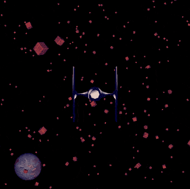

# space-traveller

Game developed using Qt and OpenGL for the Computer Graphics subject at Federal University of ABC, given by professor [João Paulo Gois](http://professor.ufabc.edu.br/~joao.gois/) in the third quarter of 2019.

## Preview

## Controls

* **Keys ASDW:** move around
* **Spacebar:** increase speed

## Built with

* Qt 5.13.1 (MSVC 2017)
* Qt Creator 4.10.1
* OpenGL 4.5.13399
* GLSL 4.40